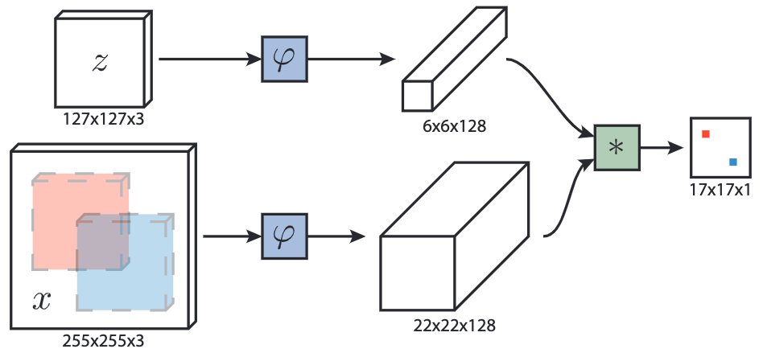

# SiamFC

PyTorch implementation of [Fully-Convolutional Siamese Networks for Object Tracking](https://arxiv.org/abs/1606.09549) (SiamFC) in partial fulfillment for a course project in EECS 542 - Advanced Computer Vision Spring 2022 at the University of Michigan, Ann Arbor. This work was done as a collaboration between Shion Matsumoto and Xiang Li.

## Introduction

The SiamFC architecture consists the same convolutional function in parallel to embed the target and search images. Once embedded, the cross-correlation of the embeddings is calculated to determine the similarities between the the target and search images, which can then be used for object tracking.

## Installation

Our implementation of SiamFC is based on [PyTorch Lightning](https://www.pytorchlightning.ai/) and draws from previous implementations. 

## Experiments

## Results

## References

[Fully-Convolutional Siamese Networks for Object Tracking](https://arxiv.org/abs/1606.09549)

[PyTorch Lightning](https://www.pytorchlightning.ai/)